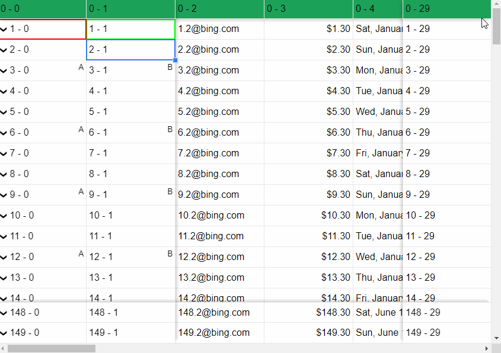
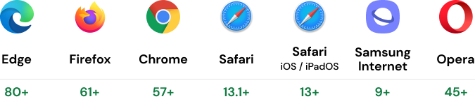
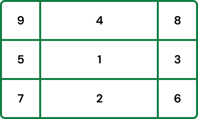
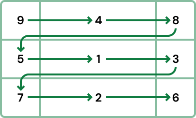
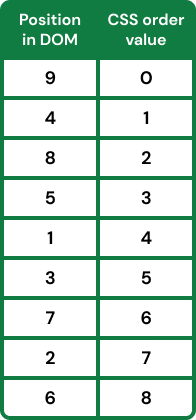
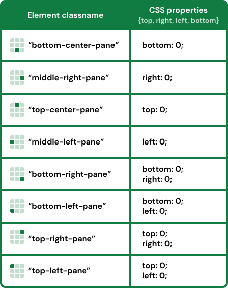
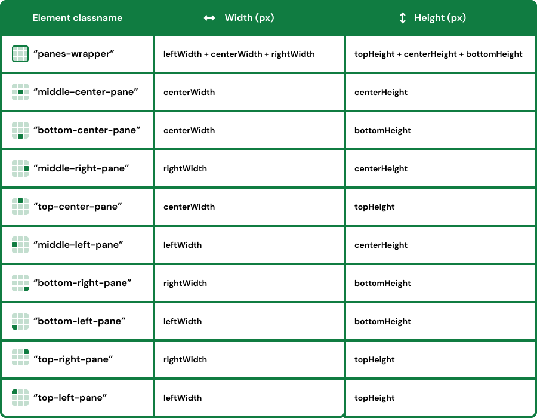
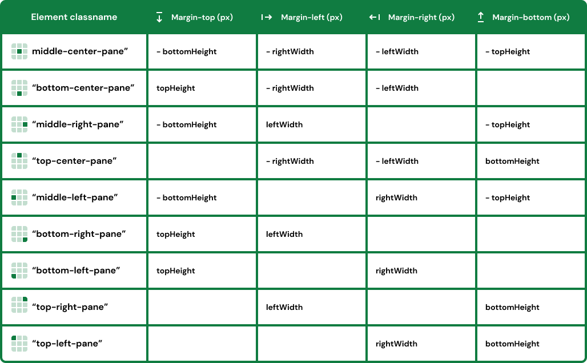
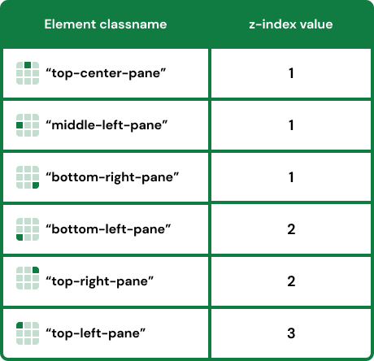

While creating user interfaces, we often encounter the problem that there is more data 
in our tables than can be fitted in the visible viewport. To achieve 
an excellent user experience on components like Gannt charts, data tables and spreadsheets, 
we often use the sticky CSS property on the header elements. 
This is a simple task when doing it only on one edge of the table.

But what if we want to display a huge table and therefore need sticky headers on more edges simultaneously? 
This is the exact problem we faced while building our ReactGrid and in this article we want to share the solution we have found.

In this guide, we will show you how to create the layout to achieve 
a native scroll behavior with sticky headers like those shown above **without using any JavaScript.**

What are the benefits of the proposed solution?
- native support from modern browsers,
- excellent user experience (intuitiveness, swiftness),
- additional elements in the scrollable view do not affect the UX,
- no JavaScript, only CSS and HTML,
- works perfectly on touch devices,
- avoids using z-index not to affect other elements on the website (needs z-index style values in Firefox with this solution).

You will learn how to place elements in the DOM and style them to achieve fully functional scrollable sticky panes using flexbox step by step. 
It's working and has been tested on the following browsers (remember, Firefox needs z-index style values).

## Placing Elements in the DOM using FlexBox

The first and most important aspect is the correct order of the elements in the DOM because elements that appear later in the DOM will overlay other elements.

Let's imagine that we want to create a layout with sticky headers on each edge. Therefore we need to divide our surface into 9 panes. 
Of course, the same procedure also applies to a smaller number of sticky edges.

We place everything in two DIV tags. The first with **overflow: auto** CSS property to have a scrollable view. The second with the following CSS properties:
- position: relative;
- display: flex;
- flex-wrap: wrap;
- justify-content: flex-start;
- align-items: flex-start.

The graphic above illustrates the proper DOM order of the elements. The first element should be the one in the center of the layout, let's call it "middle-center-pane". 
It's the only DIV element which has a relative position in its CSS styles. The next elements, in order from the least to the most important, are bottom-center-pane, 
middle-right-pane, top-center-pane and midlle-left-pane. These elements have sticky positions in CSS styles. The same situation applies to the elements located in the corners of the view. 
We placed them in the order: bottom-right-pane, bottom-left-pane, top-right-pane, top-left-pane.

<!-- https://gist.github.com/myskamil/715117ad84f80cde284a91a034ce829b?file=sticky-headers.html -->
<Gist id='715117ad84f80cde284a91a034ce829b' file='sticky-headers.html' />

Now we know in which order the panes should be placed to achieve the correct overlay behavior. However, we need more. For example, our top-left-pane is the last element in the DOM 
and will be rendered as the last one on the screen. What we need to do is to change the visual order of the elements. This can be achieved by using the CSS order property.

Let's use the illustration above and place an arrow to help us sort the elements in the right order. We need to go from the top left corner to the bottom right corner. 
This will make it easier for us to create a table to define the CSS flex order property for our sticky header elements.

We have created a solid basis to achieve the desired behavior. The panes are positioned in the right order and their overlay behavior is as expected. 
Now we need to set additional required CSS values for them. For our sticky header elements we should set **position: sticky** and the proper **top, right, left** and **bottom** CSS values.

Now we can set the size of the panes. First, we set the width and the height of the "scrollable-element". Of course, it needs to be smaller than the content, to display some scrollbars. 
Then, the width and the height of the "panes-wrapper" should be the sums of the widths and heights of containing panes.

If you have reached this step, your result might already be working as expected, but you have probably noticed that the bottom panes are covered by the top panes while scrolling. 
The same behavior also happens to the left and right panes. To avoid this overlay we need to add some margins to the panes, so that the bottom and top panes, and also the left and right panes push each other away.

At the beginning of the article it was mentioned that if you want to be compatible with Mozilla Firefox browser you need to set z-index CSS style to some elements. The table below shows the required z-index values.

## Summary & example application

If you set all properties as shown in this article, you will be able to achieve the expected result. We also prepared a quick example which allows you to look at the whole implementation. 
Feel free to use our experience and save time while trying to achieve a satisfactory outcome or try our ReactGrid.

Have fun :)

<iframe src="https://codesandbox.io/embed/scrollable-sticky-panes-t0x86?fontsize=14&hidenavigation=1&theme=dark"
  style="width:100%; height:500px; border:0; border-radius: 4px; overflow:hidden;"
  title="reactgrid-chart.js-audiogram"
  allow="accelerometer; ambient-light-sensor; camera; encrypted-media; geolocation; gyroscope; hid; microphone; midi; payment; usb; vr; xr-spatial-tracking"
  sandbox="allow-forms allow-modals allow-popups allow-presentation allow-same-origin allow-scripts"
></iframe>

