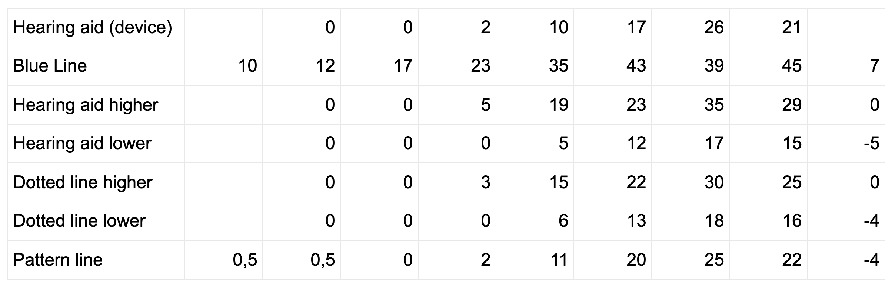

Welcome to the next article about our product - ReactGrid - React.js component for displaying data in a 
spreadsheet-like way.

This guide shows you how to integrate it with the well-known pure Javascript library - Chart.js.

## Why ReactGrid?

ReactGrid was designed with the idea of not only to display the data but also enter it.
It doesn't care about your data schema, therefore you can easily map your data to our component.
If your incoming data is not specified or you want to encapsulate an existing excel sheet into a secure app, ReactGrid should suit your needs.
Nothing restrains you from using it on a mobile device with a touch capability, thus obtaining the same experience as on a desktop.

Before we get started let's list three main tasks:

- displaying the collected data will be achieved with ReactGrid. To be **reactive** we will rerender the view only when 
  the source data has changed.
  In this example raw data comes from the audiometer - device that is used for making hearing tests. 
  In a nutshell, audiometer measures multiple hearing difficulties at many frequencies, and the audiogram is a way of
  visualizing such disorders.
- visualize the collected data on the line chart using Chart.js and its React wrapper,
- add a possibility to enter a new value and rerender the whole view with an updated state.

## Let's code!

**Define useful interfaces and types**

First, we need to declare a few interfaces and types that help us to keep everything in the right place and order.
In this particular example, we know all about the data that we want to process.
A good idea is to 'be as narrow' as possible.

<Gist id='32c10a2f03059d8153ca300d2f11314f' file='interfaces.ts' />

**Mark the columns and rows**

Relying on those interfaces now we can introduce `getColumns` function. 
In our app, we got a `Line` column, and after that, we got columns which are related to a particular frequency from 0Hz to 16000Hz.

<Gist id='cc2b0f02403956f7578205c84a137a2a' file='columns.ts' />

The next stage is mapping all the rows. We make it in a similar way to previous examples.

<Gist id='091dc8ddd23fe5b43a0522e485eb6b5f' file='rows.ts' />

**Define the data**

As we defined our data, it's time to define our data that we are working on. 
`getRawData` function returns an object whose each key must exist within the `RowsMap` interface.
Each key of this object contains an array of `Freq` objects.

<Gist id='091dc8ddd23fe5b43a0522e485eb6b5f' file='getRawData.ts' />

**Map the data to ReactGrid**

Now we are ready to generate rows that directly feed into ReactGrid. 
Each row contains the same amount of cells, but all of them can be arbitrarily placed in any order.

<Gist id='32c10a2f03059d8153ca300d2f11314f' file='getData.ts' />

**The main component - `Audiogram`**

It is time to create the main component - `Audiogram` and wrap up already written code. 
As you can see we stored our data inside React `useState` hook. 
ReactGrid always expects two props - `columns` (they are constant and don’t change over time) and `rows` 
(they are calculated every time the `Audiogram` component is rerendered).

<Gist id='32c10a2f03059d8153ca300d2f11314f' file='Audiogram.ts' />

All that's left is to render the component with:

<Gist id='32c10a2f03059d8153ca300d2f11314f' file='index.ts' />

## Apply changes with the cell editor

There are two things left to do:

1. Add a header row to mark the data (devices and all the frequencies);
2. Add possibility to edit data with ReactGrid's cell editor

**Adding the header row**

To add it we have to create a short function called `getHeaderRow`. 
As an argument, it gets a column order (as keys of columns) and returns a row object that contains only a cell of the `header` type. 
We also added some green background to those cells.

<Gist id='32c10a2f03059d8153ca300d2f11314f' file='getHeaderRow.ts' />

**Editing frequency values in cell editor**

At this moment ReactGrid behaves as a read-only. 
To change that we updated the `Audiogram` component by adding our handler function called `handleChanges`. 
We expect that only `NumberCell` will be changed, therefore we marked the `changes` argument as `CellChange<NumberCell>[]`. 
Our task is to change data on the basis ReactGrid has been rendered.

Cell editor opens when it receives double-click action or the Enter key is pressed. 
Then you can type a new value in and then commit the change. 
If we `console.log(changes)` we get an array of objects as shown below:

<Gist id='32c10a2f03059d8153ca300d2f11314f' file='changes.json' />

To change our raw data we have to find `rowId` where the change takes place. 
Then loop over all frequency samples and apply new value (`change.newCell.value`) to an appropriate cell or just return without changes.

<Gist id='32c10a2f03059d8153ca300d2f11314f' file='AudiogramWithLineChart.ts' />

## Data visualization with Chart.js

Chart.js library delivers plenty of components to visualize data, but this time we focus on a single one - 
`Line` from `react-chartjs-2` that we can use as a React component.

We have to create two functions:
1. `getChartData` - this function should return an object that contains two fields. The `labels` - which is an array of frequency title label
  and then `datasets` field to provide the `data` field which contains an array of values for each frequency. 
  You can also style your line by setting for example a `backgroundColor` or `pointRadius` for better experience.

  <Gist id='32c10a2f03059d8153ca300d2f11314f' file='getChartData.ts' />

2. `getChartOptions` - here we return an object that is compatible with `ChartOptions` interface. 
  We want to disable legend, set the title, display, and adjust axes.

That's all! The job is done, now you can check the result below.

<iframe src="https://codesandbox.io/embed/reactgrid-chartjs-audiogram-gtlgr?fontsize=14&hidenavigation=1&module=%2Fsrc%2FAudiogram.tsx&theme=dark"
  style="width:100%; height:500px; border:0; border-radius: 4px; overflow:hidden;"
  title="reactgrid-chart.js-audiogram"
  allow="accelerometer; ambient-light-sensor; camera; encrypted-media; geolocation; gyroscope; hid; microphone; midi; payment; usb; vr; xr-spatial-tracking"
  sandbox="allow-forms allow-modals allow-popups allow-presentation allow-same-origin allow-scripts"
></iframe>

## Summary

What you learned after completing this guide:
- what is ReactGrid and how to do a fully functional app; 
- how you can use it in a reactive way;
- why TypeScipt is also helpful in a small scale projects to avoid most common mistakes.

As you see integrating ReactGrid with other libraries like Chart.js is not so hard. 
Of course, you don't need to start a Typescript project and make all data mappings to compose predictable solution.
