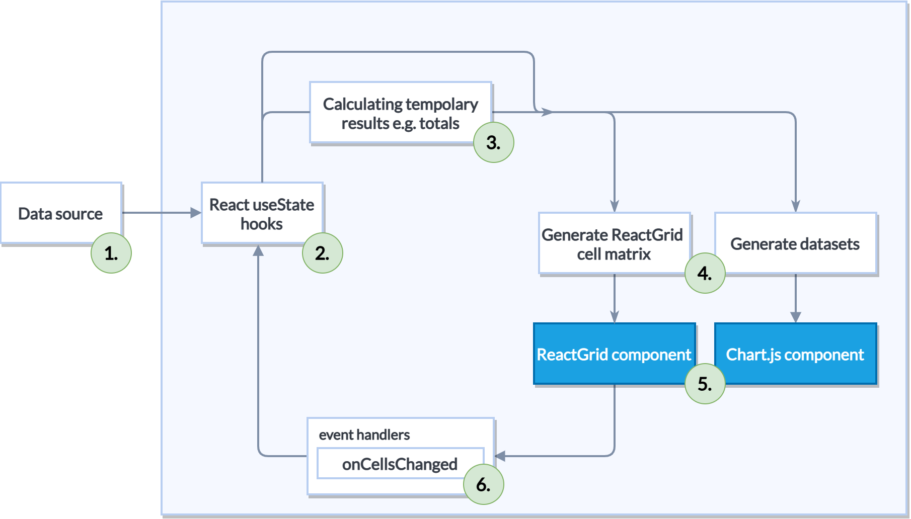

We made ReactGrid to compose your view with arbitrary cell order. In many components and tools in React ecosystem you have to
keep the same data schema in all rows. Our component breaks out from the frame. You can add it to your project simply by
running. 

<!-- https://gist.github.com/patryk0493/87547e63e1bd67105f8d023b24d82512?file=install.sh -->
<Gist id='87547e63e1bd67105f8d023b24d82512' file='install.sh' />

Even if you don't need it in your project right now, you can leave a ⭐ in our [Github project](https://github.com/silevis/reactgrid).

Today we will show you how to build a liquidity planner - an app that provides a strategy for financial planning in a long term.
Our app will provide entering, aggregating, and evaluating planned cash flows. 

On the Internet, you can find many spreadsheets files that e.g. accountants and financial analysts use -
one of them as inspiration will be moved from spreadsheet to standalone, fully **reactive** React.js app. 
We also visualize common parameters that help in decision-making with the Chart.js library.

## For what ReactGrid is it made for?

ReactGrid was designed to handle complex data displaying and editing in an arbitrary way. We break with the rule of placing
cells in the same order in every row - therefore you are able to add a spreadsheet-like experience to your React app.

Liquidity planner is one of many cases that 90% of React data table components are insufficient to recreate the expected look and feel.

## Planning app with ReactGrid

Before we starting coding we will talk about good practices that help to make predictable apps. Obviously, it's a good idea
to apply them in all projects:

1. **Separate the data from ReactGrid**

  The main concept of **reactivity** is updating your view every time that your data changes. 
  Very often we have no influence on the data structure, but we can map them to the structure that is the most convenient for us. 
  Before the data will become acceptable by ReactGrid or Chart.js we have to calculate a few variables in a repeatable way.
  This data lives only “for a moment” and should be independent of data and ReactGrid internal interfaces like `Column` and `Row`.

  <!-- https://gist.github.com/patryk0493/87547e63e1bd67105f8d023b24d82512?file=separating-data.tsx -->
  <Gist id='87547e63e1bd67105f8d023b24d82512' file='separating-data.tsx' />

2. **Apply changes directly to the data**

  ReactGrid contains its own encapsulated state to manage many background functionalities like virtual scrolling or rendering optimizations. 
  This state is based on `rows` and `columns` - two necessary ReactGrid props. ReactGrid is read-only until you define
  your own changes handling function, but a good practice is to update data at its source. 
  After that cycle of **reactivity** concept is completed.

  Be aware of updating data that are directly related with ReactGrid interfaces ⚠️

<!-- https://gist.github.com/patryk0493/87547e63e1bd67105f8d023b24d82512?file=handling-changes.tsx -->
<Gist id='87547e63e1bd67105f8d023b24d82512' file='handling-changes.tsx' />

3. **Use Typescript wherever it is possible**

  Typescript keeping us from possible bugs at runtime. We encourage you to use it, especially with ReactGrid.
  For cell templating reason we introduced a few types of how the cell templating engine interfacing with ReactGrid. 
  Thanks to this, you can safely transfer data between incompatible cells while interacting with them using the cell editor or, 
  for example, pasting data from external sources or even other spreadsheets.
  
  A concrete example will be shown in the next chapter, but for now, take a look at the tiny example of Typescript 
  [discriminating unions](https://www.typescriptlang.org/docs/handbook/unions-and-intersections.html#discriminating-unions).
  Implemented in ReactGrid's `CellChange` type allows you to ensure that the `checked` field on `newCell` really exists.

  <!-- https://gist.github.com/patryk0493/87547e63e1bd67105f8d023b24d82512?file=typescript.tsx -->
  <Gist id='87547e63e1bd67105f8d023b24d82512' file='typescript.tsx' />

4. **Compose your cell styling and behavior**

  In most cases, you will use built-in cell templates like `NumberCell` or `DateCell`. ReactGrid allows you to style `onCellsChanged`
  and its behavior without introducing for example "non-editable number cell with blue background".
  If you predict that, compose them like that:

  <!-- https://gist.github.com/patryk0493/87547e63e1bd67105f8d023b24d82512?file=composing.ts -->
  <Gist id='87547e63e1bd67105f8d023b24d82512' file='composing.ts' />

5. **Avoid merging metadata with cells**

  Since all of the cells has no idea where they are placed, it’s tempting to extend them with some metadata.
  You also can meet a similar situation that came into being when some cells are related with each other - when building a tree list.
  Let’s have a look at the `ChevronCell` interface:

  <!-- https://gist.github.com/patryk0493/87547e63e1bd67105f8d023b24d82512?file=ChevronCell.ts -->
  <Gist id='87547e63e1bd67105f8d023b24d82512' file='ChevronCell.ts' />

  Except `parentId` (which can actually be a row, column, or another cell) you can only control its look. 
  There is no place declaring tree structure, dependencies between cells, or other data.
  We recommend extracting this metadata. The easiest way is to move this logic into a separate React hook that will contain 
  those variables/data/logic.

  We will show you how to implement row toggling and working with tree-like structures in the next article.

## What does this planner do?

We could talk for a long time about financials, but there is no place for it. 
It’s time to explain all of them in a nutshell. You can skip this chapter if you like.

You can place a new value only in highlighted light green cells - opening balance, cash inflows, and outflows, and finally the credit line.

Two of them (opening balance and credit line) are just numbers. We merged types of cash flow into two. 
Each entry is called "group" and has its own title like "Traveling expenses" for outflow and "Sales" for inflow.
Except for the title, all groups have an array of the amount of money spent/earned for each month.

Groups are aggregated vertically (inflows and outflows separately) into a total inflow or outflow per month. 
The last column presents all of the totals in a calendar year.

"Cash in" and "Cash out" make up the "Total" row. This row and the other cells should update their content when sourcing data
has changed or e.g. user typed a new value into the cell.

Some items remain to be explained (and it's the hardest thing to understand): 
  - "Cumulative row" takes cash in the bank, adds "Cash in" and then subtracts "Cash out".
  - User can manipulate value green cell "Cashbox/bank" and is called an "Opening balance". The rest of the cells in this row are
    filled automatically by moving already calculated value from the cumulative to the next month in the "Cashbox/bank"
  - their operations are repeated until all moths are filled

The last part is the "Credit line". Users can update it by typing it. This variable is constant for all months and is used for 
calculating "Credit line overdraft" - in a nutshell - if the absolute value from "Cumulative" exceeds the given credit line, 
then the cell should display this result.

What about the chart? This part should give as an instant knowledge about company finance state. In this case, we limit ourselves
to display "Cashbox/bank" and "Credit Line Overdraft" as a line chart and cash inflow and outflow as bars.

## Some examples

As we mentioned in the previous chapter we have been talked about 5. tips for good app implementation with ReactGrid.

We created a fully working liquidity planner example on 
[codesandbox.io](https://codesandbox.io/embed/reactgrid-liquidity-planner-526ps?fontsize=14&hidenavigation=1&module=%2Fsrc%2FLiquidityPlanner.tsx&theme=dark). 
We will not discuss every line of code, but only code fragments through the prism of the mentioned times of work with ReactGrid.

1. **Separate the data from ReactGrid**

  App component named `LiquidityPlanner` has four React's `useState` hooks, each of them stores part of raw financial data.
  E. g. `cashInflow` is initiated with `emptyInflows` that comes from the `rawData.ts` file. These data have no connection
  with ReactGrid's interfaces, and can be used directly by other components like charts.

  <!-- https://gist.github.com/patryk0493/87547e63e1bd67105f8d023b24d82512?file=cash-inflow.ts -->
  <Gist id='87547e63e1bd67105f8d023b24d82512' file='cash-inflow.ts' />

2. **Applying changes to the data**

  ReactGrid runs your changes handler function when you interacting with the data displaying by the grid.
  Each change is applied by dispatching `setCashInflow`. To set updated inflows we used a technique called currying 
  ([more info](https://javascript.info/currying-partials)), to apply particular `change` on desired groups (`cashInflow`).

  <!-- https://gist.github.com/patryk0493/87547e63e1bd67105f8d023b24d82512?file=applying-changes.tsx -->
  <Gist id='87547e63e1bd67105f8d023b24d82512' file='applying-changes.tsx' />

  

  Implementing changes handling in this way closing the reactivity cycle, therefore our process of processing input data
  into outputs is completely repeatable and has no side effects.

3. **Typescript + ReactGrid = ❤️**

  ReactGrid is built with Typescript and fully supports it. We also encourage you to use it in your projects.
  A real example from our app shows how we narrower expected to change object type exclusively to `NumberCell`, 
  therefore you are sure that you are able to access only actually existing fields.

  <!-- https://gist.github.com/patryk0493/87547e63e1bd67105f8d023b24d82512?file=typescript-and-reactgrid.ts -->
  <Gist id='87547e63e1bd67105f8d023b24d82512' file='typescript-and-reactgrid.ts' />

  The other part is e. g. extending the set of built-in cell templates with your own. To be able to do it you have to pass the
  name of your custom Cell interface into a generic `CellChange` interface.
  
  Of course, you are not obliged to move your project right now to Typescript, but we highly suggest using static typing.

4. **Compose your cell styling and behavior**

  When you working with ReactGrid it's highly possible that you will need to achieve the same or similar behavior 
  or styling on many cells. The solution is quite simple - small, reusable functions. 
  Familiarity with [documentation](/docs/) will definitely be useful.

  <!-- https://gist.github.com/patryk0493/87547e63e1bd67105f8d023b24d82512?file=composaable-functions.ts -->
  <Gist id='87547e63e1bd67105f8d023b24d82512' file='composaable-functions.ts' />

  and the usage: a function that uses mentioned functions to fill up the cells array on a single row.

  <!-- https://gist.github.com/patryk0493/87547e63e1bd67105f8d023b24d82512?file=defining-row.ts -->
  <Gist id='87547e63e1bd67105f8d023b24d82512' file='defining-row.ts' />

## Live demo

<iframe src="https://codesandbox.io/embed/reactgrid-liquidity-planner-526ps?fontsize=14&hidenavigation=1&module=%2Fsrc%2FLiquidityPlanner.tsx&theme=dark"
  style="width:100%; height:500px; border:0; border-radius: 4px; overflow:hidden;"
  title="reactgrid-liquidity-planner"
  allow="accelerometer; ambient-light-sensor; camera; encrypted-media; geolocation; gyroscope; hid; microphone; midi; payment; usb; vr; xr-spatial-tracking"
  sandbox="allow-forms allow-modals allow-popups allow-presentation allow-same-origin allow-scripts"
></iframe>

## Summary

Liquidity planner is only one of many possible ReactGrid use cases when the standard data table is not enough.
The main purpose of this article was to show you five useful tips that help you start the ReactGrid project using good practices.

Don't forget to leave a ⭐ on our [Github project](https://github.com/silevis/reactgrid).

We encourage you to visit our official [ReactGrid website](https://reactgrid.com), 
there you will find documentation and what we offer in the PRO version of our component.

Bye 👋
