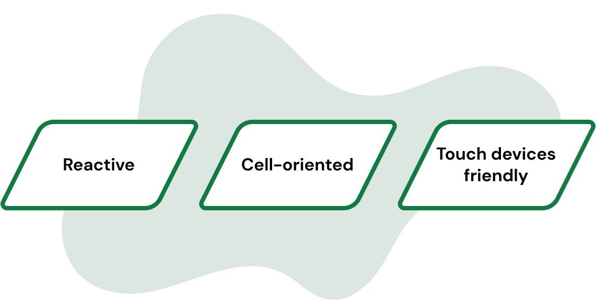
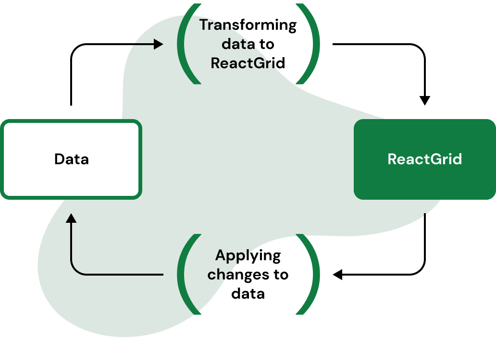
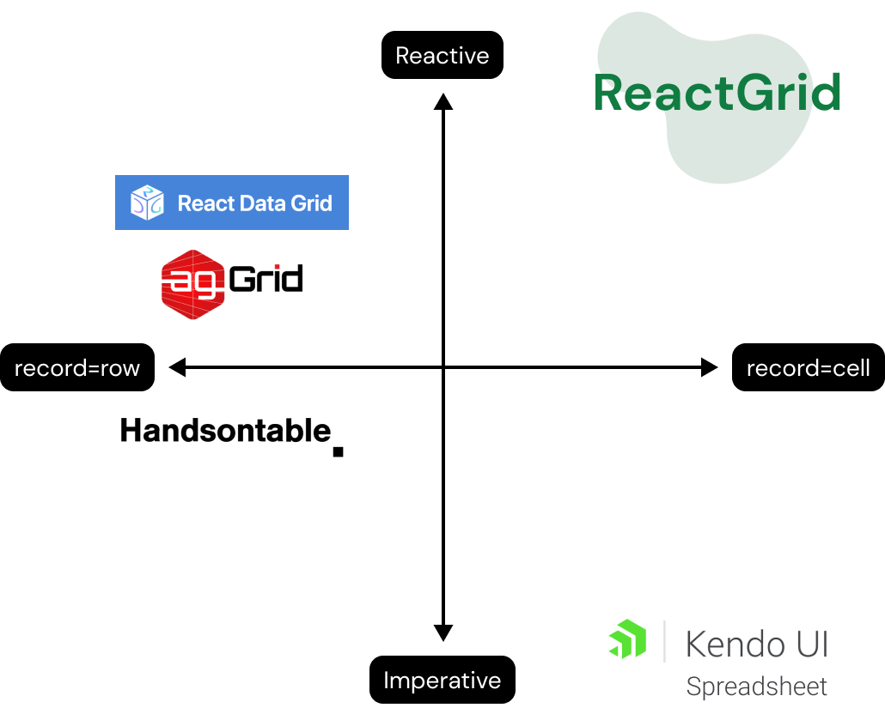
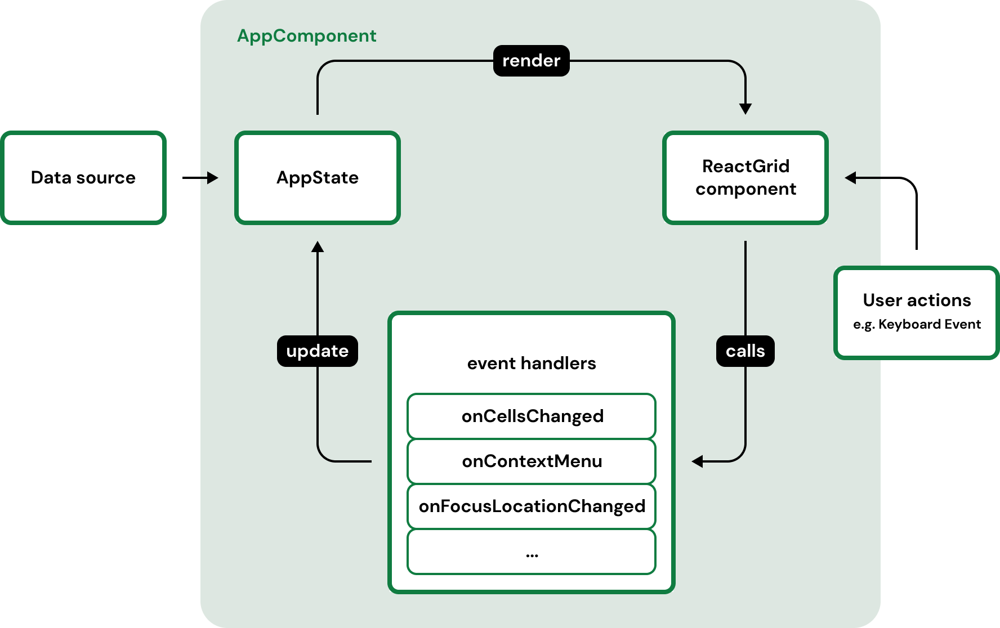

ReactGrid is a React component which enables you to add spreadsheet-like behavior to your app. It was created to satisfy a narrow group of recipients for whom other products are not an appropriate solution.

On the one hand there are data tables like Handsontable or ag-Grid. These render records row by row and offer various filtering, sorting and grouping methods. In 90% of the cases this functionality is fully sufficient.

Then there are Spreadsheet web components like KendoUI Spreadsheet or dhtmlx Spreadsheet which display regular Excel sheets in the browser. They are able to interpret formulas and offer rich editing features for the end-user.

ReactGrid places itself exactly in the middle between the two. It is not limited to a record-based model where each row has to have the same schema. The component enables you to create tables of any shape that look and feel like Excel-sheets. Additionally it integrates well with the data handling model provided by React.

<!-- # When do you need ReactGrid in your app? -->

# When do you need ReactGrid in your app?

ReactGrid was created to solve the issues in which we, web developers, weren’t satisfied with the existing spreadsheet or data grid solutions. You must have wanted to present your data in a rather unusual way more than once, for example:

- create a field that aggregates values only from selected places;
- create an unusual combination of action and reaction;
- display unstructured data, e.g. MongoDB documents;
- sort or group data with an unusual structure together;
- react to data changes in a way that is fully controlled by you;
- transfer the solution implemented in the spreadsheet to a closed application.

## Reactivity with arbitrary cell placement

To show the difference, we created a simple graph with two key aspects contained on the intersecting axes:

- vertical — reactivity — a concept taken directly from React.js library. The opposite is imperative, you have full control over actions and their influence on the current view. In most cases you should follow the following pattern:

- horizontal — arbitrary cell placement — opportunity to “Thinking in rows and columns”, each row has the same schema. Our component allows you to place any cell anywhere. We have focused on a fully controlled cell schema defined by our cell template engine. Templating is a powerful feature that allows you to define cell behavior based on its current and future data state.

We want to be (and we are) more reactive and cell-oriented. Breaking with the approach known from such alternatives as agGrid, Handsontable, it is necessary to handle events through self-implemented callbacks. Implementing a basic cell change event relies on your implementation. We prepared examples where you can just copy and paste predefined implementation.

ReactGrid’s content is rerendered only in case when visible data has changed or additional conditions such as a changed number of sticky rows and columns have appeared. Other examples might include handling scrolling (continuously following visible range for virtual scrolling), focusing cell, handling user actions like copying and pasting data. ReactGrid works perfectly even if you display a huge amount of cells — 10 000, 20 000, 100 000 is not a big deal.

Let’s talk about a simplified lifecycle based on ReactGrid. The component containing ReactGrid (AppComponent) has its data (it is a Single Point Of Truth for ReactGrid), which contains data on the basis of which the grid view will be generated.

The rendered view is ready to handle events coming from the user, e.g. changes committed in the cell editor. However, the component still behaves as read-only because a data update is required to change its contents. We can do this, for example, by implementing the onCellsChanged function (the example comes from the ReactGrid docs).

<iframe src="https://codesandbox.io/embed/reactgrid-handling-changes-crzfx?fontsize=14&hidenavigation=1&theme=dark"
    style="width:100%; height:500px; border:0; border-radius: 4px; overflow:hidden;"
    title="reactgrid-handling-changes"
    allow="accelerometer; ambient-light-sensor; camera; encrypted-media; geolocation; gyroscope; hid; microphone; midi; payment; usb; vr; xr-spatial-tracking"
    sandbox="allow-forms allow-modals allow-popups allow-presentation allow-same-origin allow-scripts"
></iframe>

## Touch devices friendly

ReactGrid works perfectly with modern web browsers. The same goes for their mobile counterparts along with touchscreens. With ReactGrid, a mobile-friendly spreadsheet-like component, you can use your app in the same fashion and experience the same productivity as on a desktop device. Let’s have a look at the basic mobile usage case — cell selection, fill handle… it just works on ReactGrid.

## ReactGrid is NOT…

You may wonder why our product “does not have” many popular functionalities, such as grouping, sorting, filtering? This is not really a disadvantage, but a feature! By getting them, you immediately agree to the restrictions imposed by the selected library. Here you manage how you sort your data and how the user can do it. Nothing prevents any cell from being, for example, a filter.

What about formulas, toolbar, and coordinates? ReactGrid is a component in which we consciously implemented only the appearance and behavior known from typical spreadsheets, but without the implementation of the outer envelope. Our purpose was not to create the next Excel, but create whatever you like around it using component API.

## Summary

In this short article, we showed three main principles which we developed ReactGrid with:
- reactivity — handle every event and process data in your way;
- arbitrary cell placement — forget about row schema and focus on cell,
- mobile-friendly — the same experience no matter what device you use.

ReactGrid gives you the freedom to display and interact with your data to create a custom view with non-row-oriented data. We use it in our projects as a tool — not a complete solution. Therefore our experience shows that every solution resolved by ReactGrid is unique. We encouraging you to browse our website and Github repo.