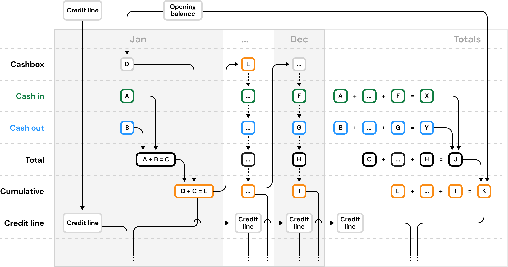
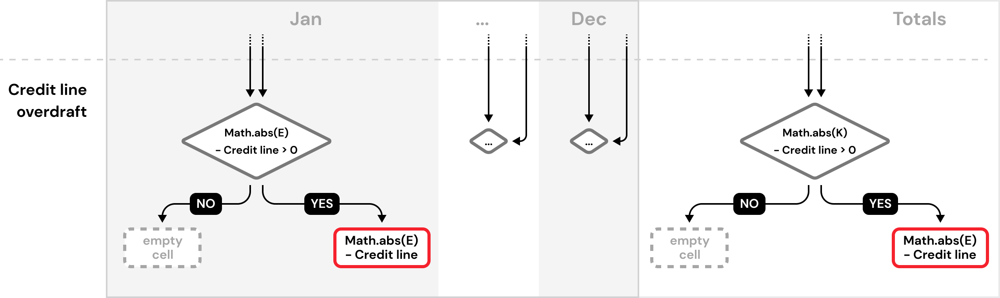

import Gist from "react-gist";

We made ReactGrid to compose your view with arbitrary cell order. In many components and tools in React ecosystem you have to
keep the same data schema in all rows. Our component breaks out from the frame. You can add it to your project simply by
running:

<Gist id="87547e63e1bd67105f8d023b24d82512" file="install.sh" />

Even if you don't need it in your project right now, you can leave a ⭐ in our [Github project](https://github.com/silevis/reactgrid).

Today we will show you how to build a liquidity planner - an app that provides a strategy for financial planning in a long term.
Our app will provide entering, aggregating, and evaluating planned cash flows.

On the Internet, you can find many spreadsheets files that e.g. accountants and financial analysts use -
one of them, as an inspiration, will be moved from spreadsheet to standalone, fully **reactive** React.js app.
We also visualize common parameters that help in decision-making with the Chart.js library.

## What is ReactGrid made for?

ReactGrid was designed to handle complex data displaying and editing in an arbitrary way. We depart from the rule of placing
cells in the same order in every row - therefore you are able to add a spreadsheet-like experience to your React app.

Liquidity planner is one of the many cases, in which 90% of React data table components usage is insufficient to recreate the expected look and feel.

## Planning app with ReactGrid

Before we start coding, we will talk about good practices that help to make predictable apps. Obviously, it's a good idea
to apply them in all projects:

1. **Separate the data from ReactGrid**

The main concept of **reactivity** is updating your view every time your data changes.
Very often we have no influence on the data structure, but we can map it to the structure that is the most convenient for us.
Before the data becomes acceptable by ReactGrid or Chart.js we have to calculate a few variables in a repeatable way.
This data lives only “for a moment” and should be independent from data and ReactGrid internal interfaces like `Column` and `Row`.

{" "}

<Gist id="87547e63e1bd67105f8d023b24d82512" file="separating-data.tsx" />

2. **Apply changes directly to the data**

ReactGrid contains its own encapsulated state to manage many background functionalities, like virtual scrolling or rendering optimizations.
This state is based on `rows` and `columns` - two necessary ReactGrid props. ReactGrid is read-only until you define
your own changes handling function, but a good practice is to update data at its source.
After that the cycle of **reactivity** concept is complete.

Be aware of updating data that is directly related with ReactGrid interfaces ⚠️

{" "}

<Gist id="87547e63e1bd67105f8d023b24d82512" file="handling-changes.tsx" />

3. **Use Typescript wherever it is possible**

Typescript prevents us from possible bugs at runtime. We encourage you to use it, especially with ReactGrid.
For cell templating reasons we introduced a few types of how the cell templating engine interfaces with ReactGrid.
Thanks to this, you can safely transfer data between incompatible cells while interacting with them using the cell editor or,
for example, pasting data from external sources or even other spreadsheets.

A concrete example will be shown in the next chapter, but for now, take a look at the tiny example of Typescript
[discriminating unions](https://www.typescriptlang.org/docs/handbook/unions-and-intersections.html#discriminating-unions).
Implemented in ReactGrid, `CellChange`interface `type` field allows you to ensure that the `checked` field on `newCell` really exists.

{" "}

<Gist id="87547e63e1bd67105f8d023b24d82512" file="typescript.ts" />

4. **Compose your cell styling and behavior**

In most cases, you will use built-in cell templates like `NumberCell` or `DateCell`. ReactGrid allows you to style
a cell and its behavior without introducing a new cell template, for example, "non-editable number cell with blue background".
Instead, you can compose the functions as follows:

{" "}

<Gist id="87547e63e1bd67105f8d023b24d82512" file="composing.ts" />

5. **Avoid merging metadata with cells**

Since all of the cells have no idea where they are placed, it’s tempting to extend them with some metadata.
By metadata we mean the data that was added to ReactGrid related interfaces (e.g. `Row`) by extending them with new attributes.

{" "}

<Gist id="87547e63e1bd67105f8d023b24d82512" file="metadata.ts" />

You can also come across a similar situation that has arisen when some cells are related with each other - when building a tree list.
Let’s have a look at the `ChevronCell` interface:

{" "}

<Gist id="87547e63e1bd67105f8d023b24d82512" file="ChevronCell.ts" />

Except for `parentId` (which can actually be a row, column, or another cell) you can only control its look.
There is no place declaring tree structure, dependencies between cells, or other data.
We recommend extracting this metadata. The easiest way is to move this logic into a separate React hook that will contain
those variables/data/logic.

We will show you how to implement row toggling and working with tree-like structures in the next article.

## What does this planner do?

We could debate financial issues for a long time, but there is not enough room for it so let's look at them in a nutshell. You can skip this chapter if you like.

You can place a new value only in light green cells (credit line, opening balance) or with white background (cash inflows and outflows).
Grayed-out cells are read-only.

Two of them (opening balance and credit line) are just numbers. We merged types of cash flow into two.
Each entry is called "group" and has its own title like "Travelling expenses" for outflow and "Sales" for inflow.
Except for the title, all groups have an array of the amount of money spent/earned each month.

Groups are aggregated vertically (inflows and outflows separately) into a total inflow or outflow per month.
The last column presents all of the totals in a calendar year.

"Cash in" and "Cash out" make up the "Total" row. This row and the other cells should update their content when sourcing data
has changed or e.g. user typed a new value into the cell.

Some items remain to be explained (and it's the hardest thing to understand):

- "Cumulative row" takes cash in the bank, adds "Cash in" and then subtracts "Cash out".
- User can manipulate the value of a green cell "Cashbox/bank" and is called an "Opening balance". The rest of the cells in this row are
  filled automatically by moving already calculated value from the cumulative to the next month in the "Cashbox/bank".
- these operations are repeated until all months are filled.

The last part is the "Credit line". Users can update it by typing it in. This variable is constant for all months and is used for
calculating "Credit line overdraft" - in a nutshell - if the absolute value from "Cumulative" exceeds the given credit line,
then the cell should display this result.

What about the chart? This part should give us an instant knowledge about the company's state of finance. In this case, we limit ourselves
to display "Cashbox/bank" and "Credit Line Overdraft" as a line chart and cash inflow and outflow as bars.

## Some examples

In the penultimate chapter, we discussed 5. tips for good app implementation with ReactGrid. We will not discuss every line of code, but only code fragments in terms of the above-mentioned tips on how to work with ReactGrid.

1. **Separate the data from ReactGrid**

App component named `LiquidityPlanner` has four React's `useState` hooks, each of them stores part of raw financial data.
E. g. `cashInflow` is initiated with `emptyInflows` that comes from the `rawData.ts` file. This data has no connection
with ReactGrid's interfaces, and can be used directly by other components like charts.

{" "}

<Gist id="87547e63e1bd67105f8d023b24d82512" file="cash-inflow.ts" />

2. **Applying changes to the data**

ReactGrid runs your changes handler function when you interact with the data displayed by the grid.
Each change is applied by dispatching `setCashInflow`. To set updated inflows we used a technique called currying
([more info](https://javascript.info/currying-partials)), to apply particular `change` on desired groups (`cashInflow`).

{" "}

<Gist id="87547e63e1bd67105f8d023b24d82512" file="applying-changes.tsx" />

Implementing changes handling in this way closes the reactivity cycle, therefore our task of processing input data
into outputs is fully repeatable and has no side effects.

3. **Typescript + ReactGrid = ❤️**

ReactGrid is built with Typescript and fully supports it. We also encourage you to use it in your projects.
A real example from our app shows how we narrowed down the expected change object type exclusively to `NumberCell`,
therefore you are sure that you are able to access only actually existing fields.

{" "}

<Gist
  id="87547e63e1bd67105f8d023b24d82512"
  file="typescript-and-reactgrid.ts"
/>

The other part is e. g. extending the set of built-in cell templates with your own. To be able to do it you have to pass the
name of your custom Cell interface into a generic `CellChange` interface.

Of course, you are not obliged to move your project right now to Typescript, but we highly suggest using static typing.

4. **Compose your cell styling and behavior**

When you work with ReactGrid it's highly possible that you will need to achieve the same or similar behavior
or styling on many cells. The solution is quite simple - small, reusable functions.
Familiarity with [documentation](/docs/) will definitely be useful.

{" "}

<Gist id="87547e63e1bd67105f8d023b24d82512" file="composeable-functions.ts" />

and the usage: a function that uses mentioned functions to fill up the cells array in a single row.

{" "}

<Gist id="87547e63e1bd67105f8d023b24d82512" file="defining-row.ts" />

## Live demo

We created a fully working liquidity planner example on
[codesandbox.io](https://codesandbox.io/embed/reactgrid-liquidity-planner-526ps?fontsize=14&hidenavigation=1&module=%2Fsrc%2FLiquidityPlanner.tsx&theme=dark).
This sample runs with the ReactGrid MIT, we encourage you to visit a [fully functional sample](https://reactgrid.com/)
deployed at our website.
There you can try extra features available only in the PRO version: fill handle, range selection, area copy/cut/paste. You can compare both versions [here](https://reactgrid.com/feature-comparison).

import LiveCode from "nextra/components/LiveCode.tsx";
import Chart from "chart.js/auto";

import { getColumns } from "../../blog/content/liquidityPlanner/getColumns";
import {
  getRows,
  CREDITLINE_ROW_ID,
  CASHBOXBANK_ROW_ID,
} from "../../blog/content/liquidityPlanner/getRows";
import {
  inflows as emptyInflows,
  outflows as emptyOutflows,
} from "../../blog/content/liquidityPlanner/rawData";
import {
  CashInflow,
  CashOutflow,
  InputVariables,
  OutputVariables,
} from "../../blog/content/liquidityPlanner/interfaces";
import { Bar } from "react-chartjs-2";
import {
  getChartData,
  chartOptions,
} from "../../blog/content/liquidityPlanner/chart";
import { calculateOutputVariables } from "../../blog/content/liquidityPlanner/plannerOutputVariables";
import {
  ReactGrid,
  Column,
  Row,
  CellChange,
  NumberCell,
} from "@silevis/reactgrid-4";
import "@silevis/reactgrid-4/styles.css";
import "../content/assets/styles.css"

<LiveCode
noInline={true}
scope={{
  ReactGrid,
  Chart,
  Column,
  Row,
  CellChange, 
  NumberCell, 
  getColumns,
  getRows,
  CREDITLINE_ROW_ID,
  CASHBOXBANK_ROW_ID,
  emptyInflows, 
  emptyOutflows,
  CashInflow,
  CashOutflow,
  InputVariables,
  OutputVariables,
  Bar,
  getChartData, 
  chartOptions,
  calculateOutputVariables
  }}
code={` const applyChange = (change: CellChange<NumberCell>) => <
  K extends CashInflow | CashOutflow
>(
  groups: Array<K>
) =>
  groups.map((group) =>
    group.title === change.rowId
      ? {
          ...group,
          values: group.values.map((value, idx) =>
            change.columnId === idx + 1 ? change.newCell.value : value
          )
        }
      : group
  );

const LiquidityPlanner: React.FC = () => {
  const [openingBalance, setOpeningBalance] = React.useState(10000);
  const [creditLine, setCreditLine] = React.useState(3000);
  const [cashInflow, setCashInflow] = React.useState(() => [...emptyInflows]);
  const [cashOutflow, setCashOutflow] = React.useState(() => [
    ...emptyOutflows
  ]);

  const columns = getColumns();
  const inputVariables: InputVariables = {
    cashInflow,
    cashOutflow,
    openingBalance,
    creditLine
  };

  const outputVariables = calculateOutputVariables(inputVariables);
  const plannerData: InputVariables & OutputVariables = {
    ...inputVariables,
    ...outputVariables
  };

  const rows = getRows(plannerData);

  const handleChanges = (changes: CellChange[]) => {
    changes.forEach((change: CellChange<NumberCell>) => {
      if (change.rowId === CASHBOXBANK_ROW_ID && change.columnId === 1) {
        setOpeningBalance(change.newCell.value);
      }
      if (change.rowId === CREDITLINE_ROW_ID && change.columnId === 1) {
        setCreditLine(change.newCell.value);
      }
      setCashInflow((cashInflow) => applyChange(change)(cashInflow));
      setCashOutflow((cashOutflow) => applyChange(change)(cashOutflow));
    });
  };

  return (
    <>
      

        <Bar
          data={getChartData(plannerData)}
          options={chartOptions}
          height={50}
        />
        <ReactGrid
          rows={rows}
          columns={columns}
          onCellsChanged={handleChanges}
          stickyTopRows={1}
          stickyLeftColumns={1}
          stickyRightColumns={1}
          // props below are availble for PRO version
          enableFillHandle
          enableRangeSelection
        />
      

    </>
  );
};

render(
<LiquidityPlanner />, document.getElementById("root"));
`}
/>

## Summary

Liquidity planner is only one of many possible ReactGrid use cases when the standard data table is not enough.
The main purpose of this article was to show you five useful tips that help you start the ReactGrid project using good practices.

Don't forget to leave a ⭐ on our [Github](https://github.com/silevis/reactgrid).

We encourage you to visit our official [ReactGrid website](https://reactgrid.com),
where you will find the documentation and information what the PRO version of our component offers.

Bye 👋
